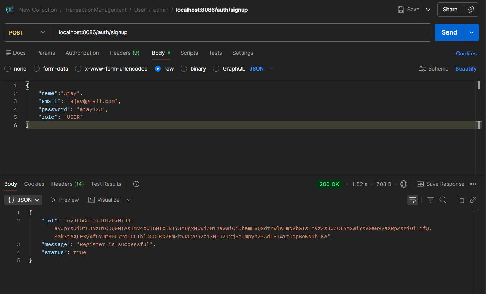
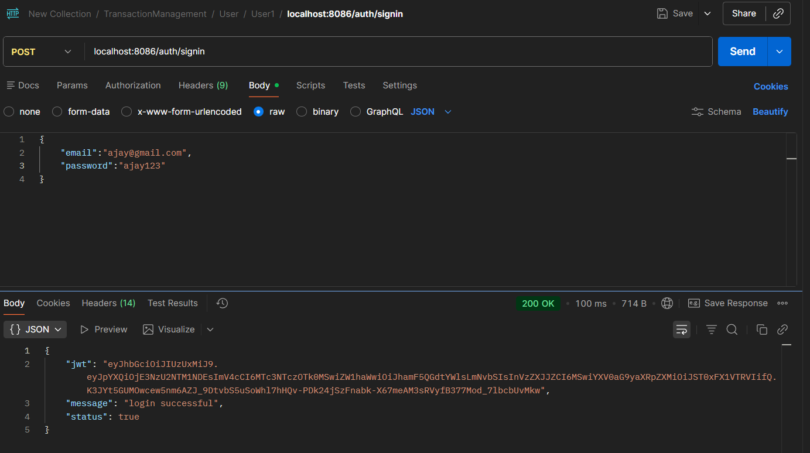
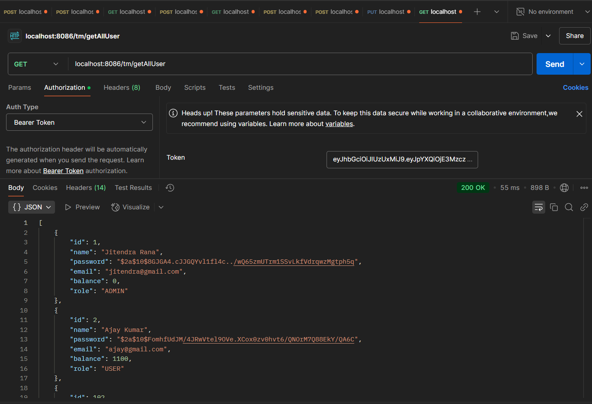
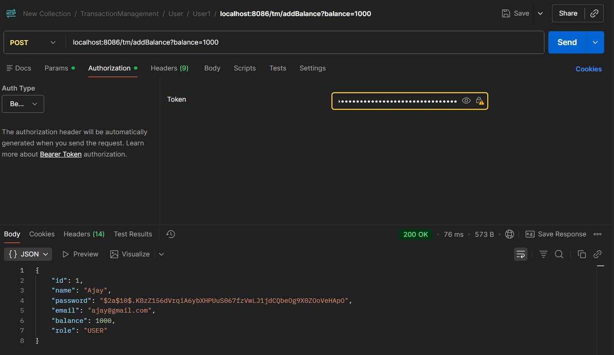
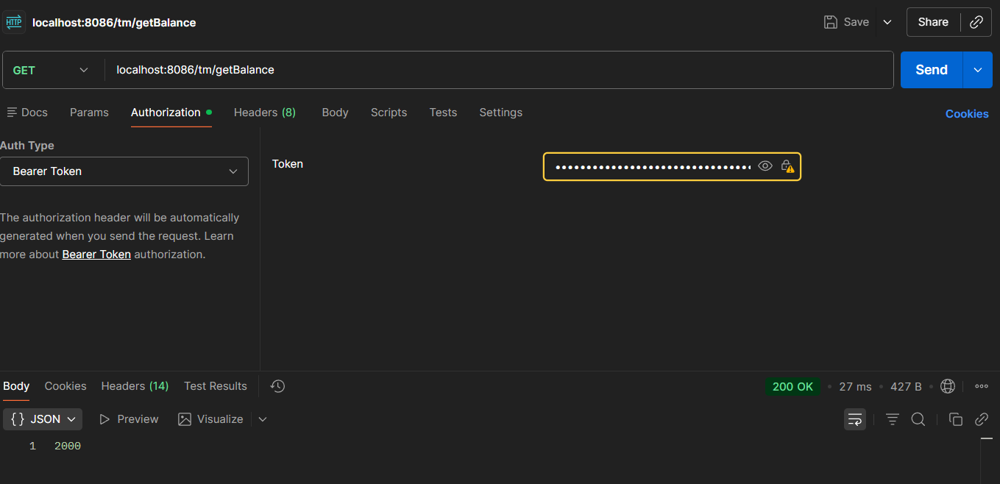
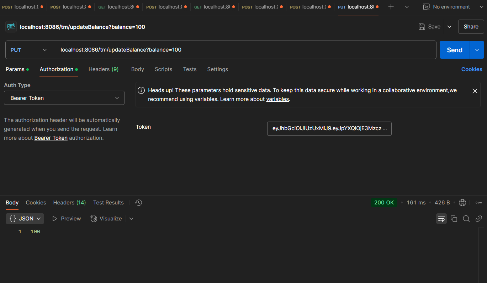
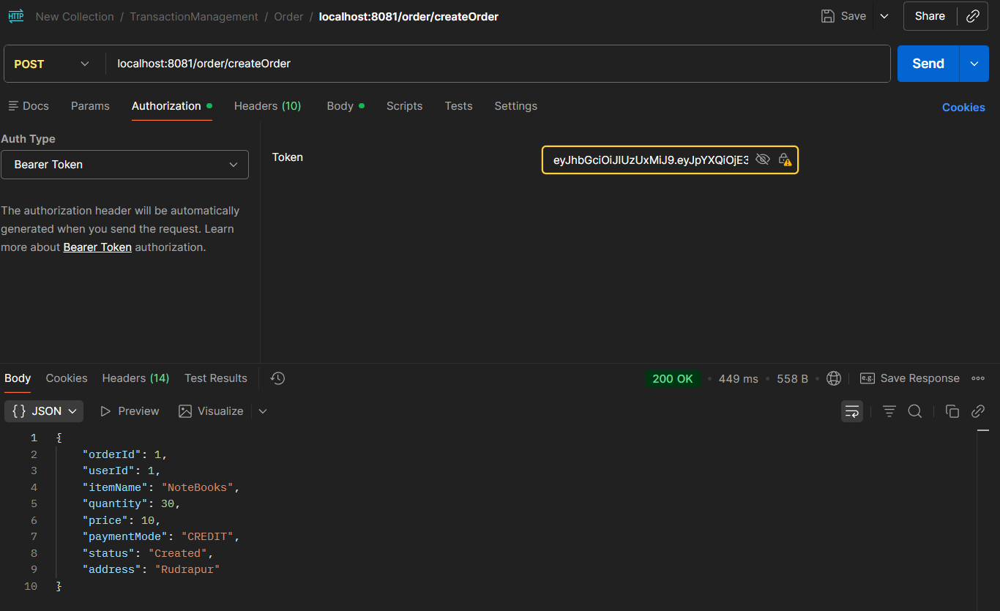
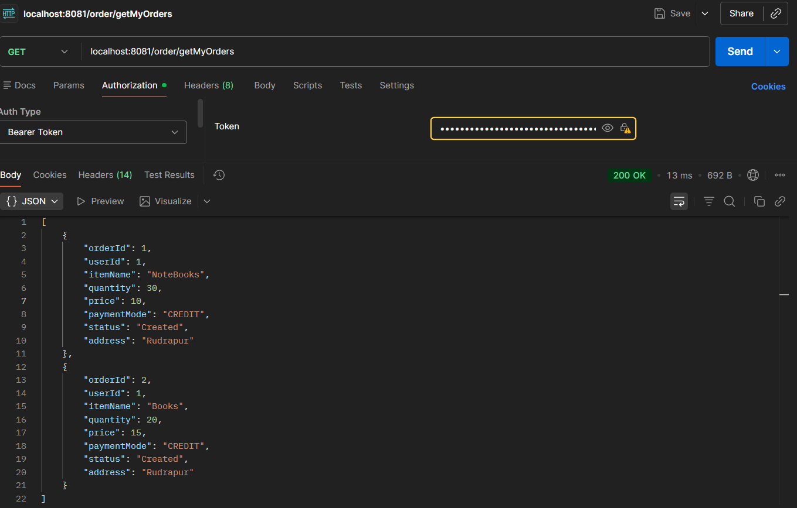
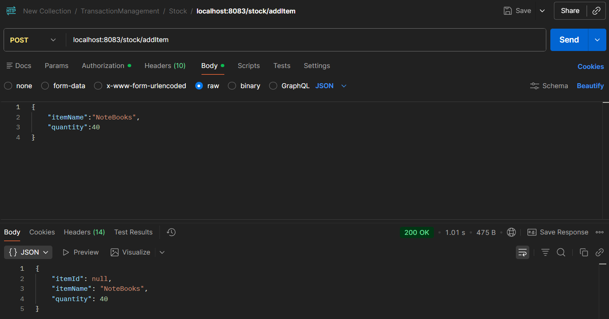
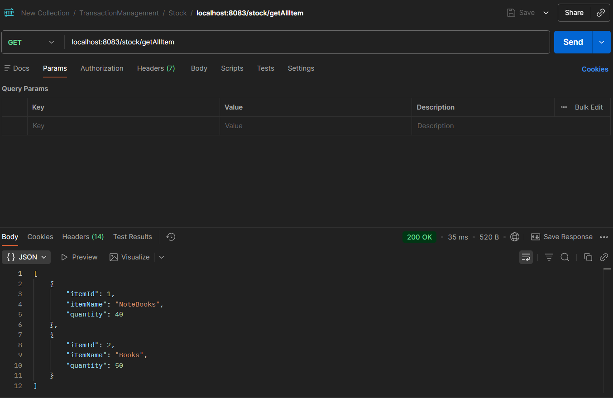

## 📑 Table of Contents

* [🚀 Tech Stack](#-tech-stack)
* [🏗️ Architecture](#️-architecture)
* [🐳 Docker Setup & Run](#-docker-setup-&-run)
* [📦 Docker Images](#-docker-images)
* [📁 Project Structure](#-project-structure)
* [✨ Features](#-features)
* [🔄 Saga Flow](#-saga-flow)
* [🔐 API Endpoints](#-api-endpoints)
* [🔮 Future Improvements](#-future-improvements)


# Order Management Saga Pattern

A distributed Order Management System built using Spring Boot Microservices, implementing the Saga Pattern for handling distributed transactions with Apache Kafka.

## Tech Stack

- Java
- Spring Boot
- Microservices
- MySQL
- Apache Kafka
- Docker & Docker Compose
- JWT Authentication

## Architecture
5 Microservices:
- User Service
- Order Service
- Payment Service
- Stock Service
- Delivery Service

Key Concepts:
- Event-driven communication using Kafka
- Saga Pattern for distributed transaction management

##  Docker Setup & Run

### ✅ Prerequisites

- Docker Desktop (includes Docker Engine and Docker Compose)
- Git

👉 After installation, make sure Docker Desktop is running.

---

### 🚀 Steps to Run the Project

### 1. Clone the repository

```
git clone https://github.com/jitendra511/Order-Management-Saga-Pattern-.git
```

---

### 2. Navigate into the project directory

```
cd Order-Management-Saga-Pattern-
```

---

### 3. Start Docker Desktop

Ensure Docker is running before proceeding.

---

### 4. Run the application

```
docker-compose up -d
```

> This will start all microservices, MySQL, and Kafka containers.

---

### 5. Stop the application

```
docker-compose down
```


### ⚠️ Notes

- Ensure required ports are free (e.g., 8080, 8081, etc.)
- Kafka & MySQL containers will start automatically via Docker Compose


## Docker Images

- jitendra511/user-service:v1
- jitendra511/order-service:v1
- jitendra511/payment-service:v1
- jitendra511/stock-service:v1
- jitendra511/delivery-service:v1

  <p align="center">
  
  <br/>
  <em>Docker Hub repositories for all microservices</em>
</p>

## Project Structure

```
project-root/
│
├── user-service/
├── order-service/
├── payment-service/
├── stock-service/
├── delivery-service/
│
├── docker-compose.yml
├── mysql-init/
│   └── init.sql
│
└── README.md
```

## Features

- Microservices Architecture
- JWT Authentication (Role-based: Admin/User)
- Saga Pattern Implementation
- Event-driven communication using Kafka
- Distributed transaction management

## Saga Flow
- User creates order
- Order service publishes event
- Payment service processes payment
- Stock service updates inventory
- Delivery service handles shipment


## 🔐 API Endpoints

### 1. Signup

* **Method:** POST
* **URL:**

```
http://localhost:8086/auth/signup
```

* **Description:** Register a new user

<p align="center">
  
</p>

---

### 2. Signin

* **Method:** POST
* **URL:**

```
http://localhost:8086/auth/signin
```

* **Description:** Log in the user

<p align="center">
  
</p>

---

### 3. Get All Users (Admin Only)

* **Method:** GET
* **URL:**

```
http://localhost:8086/tm/getAllUser
```

* **Description:** Retrieves all users

<p align="center">
  
</p>

---

### 4. Add Balance

* **Method:** POST
* **URL:**

```
http://localhost:8086/tm/addBalance
```

* **Description:** Add balance to the logged-in user

<p align="center">
  
</p>

---

### 5. Get Balance

* **Method:** GET
* **URL:**

```
http://localhost:8086/tm/getBalance
```

* **Description:** Retrieve balance of the logged-in user

<p align="center">
  
</p>

---

### 6. Update Balance

* **Method:** PUT
* **URL:**

```
http://localhost:8086/tm/updateBalance
```

* **Description:** Update the balance of the logged-in user

<p align="center">
  
</p>

---

### 7. Create Order

* **Method:** POST
* **URL:**

```
http://localhost:8081/order/createOrder
```

* **Description:** Create a new order

<p align="center">
  
</p>

---

### 8. Get My Orders

* **Method:** GET
* **URL:**

```
http://localhost:8081/order/getMyOrders
```

* **Description:** Retrieve all past orders of the logged-in user

<p align="center">
  
</p>

---

### 9. Add Item to Stock (Admin Only)

* **Method:** POST
* **URL:**

```
http://localhost:8083/stock/addItem
```

* **Description:** Add item to stock

<p align="center">
  
</p>

---

### 10. Get All Items of Stock

* **Method:** GET
* **URL:**

```
http://localhost:8083/stock/getAllItem
```

* **Description:** Retrieve all items from stock

<p align="center">
  
</p>

##  Future Improvements

- Implement centralized API Gateway (Spring Cloud Gateway)
- Add Service Discovery using Eureka
- Add monitoring using Prometheus & Grafana
- Implement retry & circuit breaker (Resilience4j)

  
